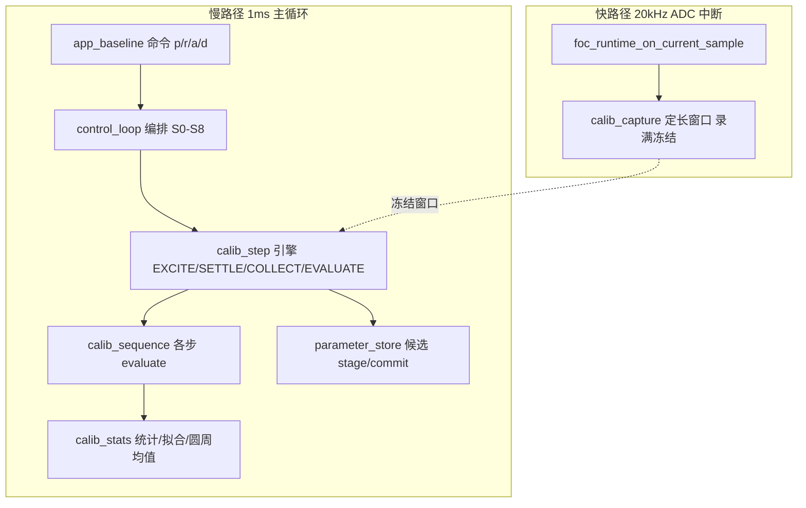

# 01 · 标定系统详细设计

> 状态：批次 A（静止电气 S0–S4）+ 批次 B（S5/DIR 手动判向）已上板走通；SPEC-RUN R1（S7 收口 + R 自学习）代码就绪待上板验收（2026-09-11，见 `06_验证与实验记录/调试日志/20260911_SPEC-RUN代码补全状态核查与实施.md`）
> 最后对齐：2026-09-13 S1a/P3 补恒等前置契约（两处 FR-2.4 注入点均剔除 phase_map：prepare 恢复块 + boot [LOAD]，修固化后通道交叉假故障）｜ 2026-09-11 SPEC-RUN R1 代码级实施（S7 块统计/相序门禁/候选 v2/R 四级自学习）｜ 上游规格：SPEC-CAL（S0–S8、第 6/8/10/11/12 章，r2）、SPEC-RUN R1（FR-1.1~1.6）

## 1. 职责与边界

- 一句话职责：在安全门禁下编排半自动（默认）/ 全自动标定序列，完成电流链路确认、R/L/PI、编码器参数辨识，产出带质量证据的候选参数包。
- 负责：标定 step 时序引擎、采样窗口、小样本统计、S0–S8 各步判据、候选组装与 apply/discard。
- **明确不做**：
  - 不承担正常运行闭环（正常固件走 SPEC-CAL 5.1 普通启动路径）；
  - 不做运行时自动换相序、不写 `phase_map`（相序只验证，不自洽则提示人工改线）；
  - 不做 Ld/Lq、MTPA、弱磁、HFI、无感、惯量/外环自整定（见 SPEC-CAL 1.3 剪枝边界）。
- 上游：电流采样（DD-03）、控制环（DD-02）、位置反馈（DD-04）提供可信数据与闭环能力；下游：参数存储与安全状态机（DD-05）。

## 2. 架构位置



## 3. 文件清单

| 文件 | 角色 |
| --- | --- |
| `calib_stats.c/.h`【M1 已落地；2026-09-11 增 S7 块统计】 | 纯函数数学库，零 HAL 依赖，可 PC gcc 单测：去极值均值/中位数/IQR/最小二乘/圆周均值/unwrap；新增 `calib_s7_dyn_r_init/feed/finalize`（建立段剔除→\|Iq\|门→分块 ratio-of-means→块级截尾均值，FR-1.2） |
| `calib_capture.c/.h`【M1 已落地】 | 快路径定长采样窗口，按 stride 写入、录满自停冻结（64×32B=2KB 静态） |
| `calib_step.c/.h`【M1 已落地】 | 通用 step 引擎 EXCITE→SETTLE→COLLECT→EVALUATE（收敛/超时/Welford 统计），终态由调用方判 |
| `calib_config.h`【M1 已落地；SPEC-RUN 增 S7/RLEARN 宏】 | S0–S8 过程参数（档位/时长/容差/窗口）集中，纯宏、起始值待整定 |
| `calib_sequence.c/.h`【批次 A 已落地 s1–s4】 | 各步 evaluate 判据/跟踪器，纯函数零 HAL 可 PC 单测；s5–s8 待批次 B/C |
| `control_loop.c/.h`【批次 A/B 已改；SPEC-RUN R1 已接线】 | S0–S5 引擎化 + ENCODER_DIR 手动判向；S7 判定重构为 `control_loop_judge_s7_and_create_candidate`（四道门+候选包 v2）；PSEQ 相序验证跟踪；apply/clear/DONE 语义按 FR-1.3/2.5 |
| `resistance_learning.c/.h`【SPEC-RUN 新增】 | R 纯软件自学习/自裁决四级门（FR-1.5）：单次可信门（caller 判）→跨启动重复门→双源交叉门→失控护栏；load/store 随参数包 v2 固化；纯函数零 HAL 可 PC 单测 |
| `foc_identification.c`【保留】 | derive_current_pi 仍用（生效 R 驱动）；单点 R/两点 L 估计保留但 A 组改走多点，暂不调用 |
| `motor_parameter_store.c/.h`【SPEC-RUN 已改造】 | 参数包 v2 + 双页 A/B 择优 + stage→commit（Flash）+ RAM 激活 + clear；纯逻辑下沉 `motor_parameter_core.c`（CRC/校验/迁移/择优）、Flash 后端 `motor_flash_store.c`（详 DD-05） |

## 4. 关键数据结构

```c
/* 快路径每拍一行（约 32B） */
typedef struct { float id,iq,vd,vq,ia,ib,ic; uint32_t cycle; } calib_sample_t;

/* 通用 step 引擎 */
typedef enum { STEP_IDLE=0, STEP_EXCITE, STEP_SETTLE, STEP_COLLECT,
               STEP_EVALUATE, STEP_PASS, STEP_NOGO } calib_step_phase_t;
typedef struct {
  float settle_band; uint16_t settle_hold_cycles, collect_n; uint32_t timeout_ms;
  calib_step_phase_t phase; uint32_t t0_ms; uint16_t in_band_run;
  float mean, spread; uint16_t used_samples;
} calib_step_t;

/* 进参数包的可追溯质量块（package 末尾，CRC 覆盖） */
typedef struct {
  uint16_t r_sample_count,l_sample_count,offset_repeat_count;
  float r_fit_residual,l_spread_ratio,offset_circ_std_rad,offset_fwd_rev_diff_rad;
  float sign_residual_ratio,step_overshoot_ratio,settle_time_ms;
  uint32_t calibrated_tick;
} calib_quality_t;
```

字段单位/范围/谁写谁读：【待填写：实现时按 DD-05 参数生命周期补"写入者=对应 Sx，读取者=S8/正常启动"】

## 5. 关键流程与状态机

通用引擎四阶段（替代旧 `if(elapsed>=固定ms)`）：

```
EXCITE  : 上电/阶跃/锁角给激励
SETTLE  : |measure-target|<=band 连续 hold_cycles -> COLLECT；超过 timeout_ms -> NOGO
COLLECT : 从冻结窗口取 collect_n 个样本算 mean/spread
EVALUATE: 本步 evaluate(mean,spread,窗口) -> PASS / NOGO
```

S0–S8 与运行态映射：

| Step | 运行态（复用/新增） | 激励 | 量化 go 判据 | 输出 |
| --- | --- | --- | --- | --- |
| S0 | TEST_BOOT/READY | 不上电 | 零偏质量 OK + 编码器在线 | 运行零偏 |
| S1a | **SIGN_CALIBRATION（开环档位爬坡扫描，备选）** | θ=0，**绕过 PI**，Vd 从 0.05V 按 0.03V/档爬到 VEND=0.31V，每档缓升3/建立5/采集35ms；正向电流进目标带即收，回零后反向扫相同档数 | V-I 最小二乘 r2≥0.98、扫描最大\|du\|进目标带、正/负斜率同号、对称≤0.25、斜率比 kv/ku≈-0.5、标准增益下 R 在 0.5~2× | sign_u/v、通道自洽、粗 R 与死区 Voff、置 direction_verified |
| S1a′ | **SIGN_CALIBRATION（静态三角度探针 PROBE3，当前默认主路径 `CALIB_S1A_PROBE3=1`）** | 电机锁定不转，电角度依次 0/120/240°，每角度"零矢量基线40→注入0.15V（建立10+采集40）→回零衰减15ms"，全程开环 VOLTAGE，约0.3s | U 独大在0°、V 独大在120°；非独大/独大≈−0.5±0.15；第三相 −(U+V) 独大在240°；U/V 等幅（差≤20%）且两独大≥30code | sign_u/v、U/V↔半桥1/2 通道对应、置 direction_verified；通过即断电、再按 p 进 S1b。**只定采样符号/通道，不涉电机旋转线序与编码器方向（批次 B S5/S6）**；爬坡扫描降为备选（编译开关可切） |
| S1b | **SIGN_CALIBRATION（闭环自证）** | 方向验证后建 Id=0.50A、Iq=0 电流环（2026-09-13 临界大信号整定，原 0.20A） | step 引擎判 Id 收敛 + Iq≈0、无正反馈/振荡 | 电流环方向正确，arm S2 |
| S2 | ~~R_IDENTIFICATION~~（短路） | —— | **不辨识，采用标称 R=2.3Ω**；TEST_STEP_R 直接以标称重算 PI ki 并跳 TEST_STEP_L，误差交由 PI 补偿 | R（=标称） |
| S3 | ~~L_IDENTIFICATION~~（短路） | —— | **不辨识，采用标称 L=0.86mH**；TEST_STEP_L 直接以标称重算 PI kp 并跳 S4，误差交由 PI 补偿 | L（=标称） |
| S4 | CURRENT_VALIDATE | Id 0→0.06 阶跃 | 静差/建立时间/振荡/饱和四项 | Kp/Ki、电流环可用 |
| S5 | SENSOR_CALIBRATION | 锁 θ=0 重复 N≥4 正反向 | 圆周均值，圆周 std/正反差达标 | offset |
| S6 | **新增 DIRECTION_CALIBRATION** | advance_forced_angle 慢扫整数电周期 | θe-vs-θm 拟合斜率符号=dir、取整=pp | direction、pp |
| S7 | LOW_SPEED_CAPTURE（**判据 v2，2026-09-13**） | 编码器电角度闭环，id=0.10A/iq=0.18A（工程窗口），捕获 2500ms | 四道门依次：①机械行程/力矩方向一致（不变，FR-1.3.2）；②**调节品质门**：建立段后全程窗均值 wid/wiq 贴目标带；③**EMF-free 动态 R**：每窗 wvd/wid 比值的中位数落 [0.5,1.5]×本次 S2；④R 自学习 update（不变） | 动态 R（打印中位数/窗数/IQR/窗界）+ 候选包 v2 |
| S8 | CANDIDATE_REVIEW（**SPEC-RUN 已收口**） | 停机 | store 五道校验（下沉 motor_parameter_core） | 候选包 a/d；a 按 phase_seq_verified 分流 Flash 固化 / RAM 激活 |

> 落地状态：**S0–S4 已在批次 A 实现并编译入库**；2026-09-09 起 S1 重构为两段式——S1a 用控制器新增的 `VOLTAGE` 开环模式注入（`foc_runtime_set_voltage_target`，CURRENT 闭环必须 `closed_loop_allowed`、VOLTAGE 仅 test_mode 放行），通过后短暂停功率再以 CURRENT 重启进 S1b；**同日晚 S1a 由"固定 ±0.09V 三段"升级为"电压爬坡自适应扫描 + V-I 线性拟合"**（原因：固定 0.09V 理论仅 ~24code、小于零偏 p2p 噪声带，实测 7~13code 判 weak；爬坡以实测电流进目标带为主闸门、VEND=0.31V 作采样失效兜底，用整条 V-I 线的斜率/截距同时定 sign/通道/粗R/死区，见调试日志 §12）；S3 首次启用 calib_capture 快窗口（τ=L/R≈0.37ms 快于 1ms 慢周期）；S4 用独立 s4_tracker。S5/S6 属批次 B、S7/S8 属批次 C。A 组完成后停在 TEST_READY（next=DONE），不进入未改造的转动流程。**2026-09-09 晚再演进：S1a 主路径由"单点 θ=0 爬坡"改为"静态三角度探针 PROBE3"**——单点 θ=0 的两相电流投影存在歧义（10V HOLD 实测同号、幅度倒置无法唯一归因），而半桥支路电流只由 SVPWM 电压决定、与电机线排列无关，故静态只能定采样符号与通道对应；PROBE3 在 0/120/240° 各取相对零矢量基线的 raw 偏移，靠"独大落角 + 非独大≈−0.5 + 第三相重构独大在240°"唯一解 sign_u/v 并校验通道，纯函数 `calib_sequence_s1_probe3` 可 PC 单测；电机旋转线序/编码器方向仍归批次 B。**2026-09-13 晚 ROM 瘦身（M-E 前置，Code 区余量仅 364B）**：使命完成的诊断打印退役——[S7DBG] 逐窗遥测（窗结算逻辑保留、只删打印）、[DBG] S1b/S4 过程行、[P3] 逐角度行（保留 DIR 结论行）、[PSEQ] 逐排列行（保留 best/verify/commit）；VJ 判决工具 `CALIB_VJ_DIAG_ENABLE=0` 整体编译关断；上电静态诊断 quiet 化（PASS 一行汇总、WARN/FAIL 必打、`i` 全量）；[DIR] 手转进度 1.5s→3s。保留集不变：banner/[READY]/[RUN]/[RESULT]/[LOAD]/[APPLY]/[FAULT]/门禁拒绝全量。实测省出 **3012B**（Code 57236→54752、RO 5872→5360；ROM 63124→60112，余量 3376B，rebuild 0E/0W）。

## 6. 关键机制与取舍（核心）

1. **冻结窗口免锁**：快路径只在窗口未满时 push、写满自停；慢路径在保持/停机后读已冻结数据，因此快/慢路径之间无需关中断、无锁。否决了"环形缓冲+临界区拷贝"方案（关中断拷贝 2KB 影响 20kHz 确定性）。
2. **S1 在 raw 层判符号，且开环建激励，双重避免循环论证**：
   - *测量层*：sign 本身待标定，若用带默认 sign 的安培值判 sign 是循环论证；故用零矢量基线 + 爬坡扫描各档原始 raw 差，对正/负点做一阶最小二乘，以**斜率符号**定 sign、**斜率比 kv/ku≈-0.5** 定通道（整条线比值比单点抗噪）、斜率反推粗 R、截距反推死区等效电压；正/负斜率同号且幅值对称查方向单调与对称性。
   - *控制层（早期版本漏检、本次补上）*：建电流闭环本身就要用到待验证的 `phase_sign`，若 sign 反了，SETTLE 阶段就正反馈发散、永远到不了判 sign 的 EVALUATE。因此符号未验证前**禁止**用 Id 闭环做 S1，只能用绕过 PI 的开环 `VOLTAGE` 模式注入；判据通过、写 sign、置 `direction_verified` 后，才允许建 S1b 电流闭环自证。
3. **`|Ia+Ib+Ic|≈0` 不是独立证据**：Ic 由 -Ia-Ib 重构，三者和恒为 0 是定义；查通道/增益一致性真正有效的是幅值比 -0.5。
3b. **控制律准入门禁（控制层依赖链）**：不同控制律对"已验证前提"的要求不同，固件按下表强制，`foc_runtime_start()` 按请求模式 + 验证标志决定放行，test_mode 只放行开环 VOLTAGE、不再无差别放行闭环：

   | 控制律 | 必需前提（缺即拒，PI 救不回） | 有保守初值即可 | 本阶段是否依赖编码器 |
   | --- | --- | --- | --- |
   | 开环 VOLTAGE 注入(S1a) | 安全链路、采样-PWM 同步、零偏 OK、Ts/算力 | 标准增益、标称 R/L | 否（forced θ=0） |
   | 电流闭环 CURRENT(S1b/S2/S3/S4) | 上述 + **采样极性 sign、通道自洽(direction_verified)** | 标称 R/L 派生保守 PI、标准增益 | 否（forced θ=0） |
   | 编码器闭环/转动(S7) | 电流环可信 + offset/方向/pp(S5/S6) | 磁链 | 是 |
4. **收敛触发替代固定延时**：固定时间降级为保护性超时；进容差带并连续 K 周期才采样，保证每次都在稳态取值。
5. **相序只验证不自改**：测量 sign 可自动回写；功率相序错只报"需交换的相线"，由人工改线并 `wiring_revision++`，固件不做运行时换相。
6. **L 的时间基准用 cycle 不用 ms**：TIM3 与 TIM2 未主从锁相，`Δcycle·Ts` 比 HAL_GetTick 抖动小。
7. **统计/拟合/atan2 全在慢路径**：无 FPU，sin/cos/atan2 不得进 20kHz 中断；快路径只做 32B 拷贝，不新增浮点。
8. **S6 方向可自动翻、pp 不可自动改**：方向反允许自动翻转并重算 offset（记日志）；pp 与候选 7 不符判 NOGO，防掩盖打滑/配置错。
9. **observer 解耦（M1 已落地）**：`foc_runtime` 不依赖 calib 层，只暴露 `foc_runtime_set_output_observer(fn)` 函数指针；标定侧把 `calib_capture_push` 包一层注册进去，快路径每拍回调一次，注销传 0。未注册时快路径仅一次指针判空、零额外开销，算法内核不感知标定存在。
10. **S7 判决出口内聚（SPEC-RUN R1，2026-09-11）**：`control_loop_judge_s7_and_create_candidate` 一个函数决定去留——正常路径产出候选进 CANDIDATE_REVIEW 并打印 [RESULT]/[RLEARN]/[NEXT]（NEXT 按 phase_seq_verified 区分 flash/RAM only）；行程/力矩矛盾不产候选、回 TEST_READY 并提示重跑 PHASE_SEQ。避免"先产候选再外部否决"的两段式状态污染。
11. **R 自学习四级门（SPEC-RUN FR-1.5，`resistance_learning.c`）**：①单次可信门在 caller（S2 r2/\|Voff\|/样本数，`control_loop_s2_trusted`）——库只收可信值，职责分离；②跨启动重复门以"独立上电"为采样单位，per-boot adoption latch（`control_loop_s2_adopted`）保证同一次上电多次 r=restart 只采纳首个可信 S2，`control_loop_init`/`request_identification_start` 均不清学习状态（掉电或 c=clear 才清）；③双源交叉门基准是**本次 S2 实测**而非编译期标称（防"标称错→窗错→全错"连锁）；④失控护栏只记录不采纳、人工介入。learned_R 随参数包 v2 固化跨启动，上电 `resistance_learning_load` 重建、生效 R 驱动电流环 ki（`resistance_learning_effective_r`，护栏在生效时再验一次防包被误写）。
12. **S7 动态 R 块统计（FR-1.2，`calib_s7_dyn_r_*`）**：ratio-of-means（块内 ΣVq/ΣIq）而非逐样本比的均值——分块本身就抗单拍噪声，块级再截尾；空块丢弃、缓冲满封顶不计（防长捕获翻数组）；建立段（500ms）与 \|Iq\| 门（0.5×工作点）在库内统一，`control_loop_init` 从 calib_config 派生（改工作点全联动，杜绝"目标 0.2A、门限 0.01A"形同虚设）。
13. **【规格偏差记录】S7 入口对"相序未验证"取硬拦而非"进入但标注"（FR-1.3.1，2026-09-13 登记）**：SPEC-RUN FR-1.3.1 原文为"相序未验证时允许进入 S7，但候选包/日志必须标注、且不得永久固化"；实现（`control_loop` TEST_STEP_CAPTURE 入口门禁）更严——`phase_seq_verified==0` 直接拒绝进入 S7（同门还有 `s5_ok`，偏置不可信同样硬拦）。理由：镜像未裁决时换相可能反向，加转矩即堵转、Iq 追不到目标、Vq 顶限压拉垮母线（2026-09-12 S7 硬发散实测；勘误后主因定位于测量侧 phase_map 不对称，但错误映射下 S7 会发散仍是既证事实）。规格要求的下游防线完整保留作双保险：候选包携带 `phase_seq_verified` 标注、apply 对未验证候选只走 RAM 激活不进 Flash。若需回到规格原义（允许进入并标注），改动点集中在 TEST_STEP_CAPTURE 入口两行门禁。
14. **VJ 电压注入判决模式（L4 诊断工具，2026-09-13；不在 S0–S8 序列，不产候选、绝不落盘）**：`CONTROL_LOOP_STATE_VJ_DIAG` 子状态机（IDLE→HOLD→PULSE/SWEEP，`control_loop_request_vj_start/power/inject/sweep/exit`）。静止判决：单轴开环注入 `CALIB_VJ_INJECT_V`=0.3V 持续 200ms（跳过前 100ms 建立段、拍均值累计），打印 `[VJ] th=… v*=… -> id/iq(n)/dU/dV`——`d/e`=±Vd、`q/w`=±Vq 构成 2×2 响应矩阵 M：近对角（on-axis ≈ 0.3/R）= 帧一致；det(M)<0 = 反射（换相置换类）；旋转 ±120° = 循环映射错位；M 随转子位置以 2×θe 变化 = 反射分量；dq 脏而 raw 干净 = 嫌疑推向采样/角度链。旋转对照：`g` = vq=+0.3V 持续 2500ms、`[VJT]` 每 50ms 遥测（θe/id/iq/vq/dU/dV）——**静止 M 干净但旋转扫描脏** 即锁定"旋转相关"环节（头号嫌疑：ADC 采样时刻，用 `BOARD_CONFIG_ADC_TRIGGER_OFFSET_TICKS` 扫相位窗）。门禁与 S0 同源（零偏质量+编码器在线）+ 静默态白名单；角度供给与 S7 同源（编码器连续出角，判的就是 S7 那条链）；**编码器门禁去抖 60ms**（连续无效才 FAULT、期间保持上一帧角度——2026-09-13 上板教训：使能瞬间栅驱 boost 瞬态干扰单次 I2C 读数，零去抖门禁在上电第 1ms 误判）；`x` 退出回 TEST_READY，序列位置原样保留。构建身份：版本串 0.5-l4diag + banner `__DATE__ __TIME__` 行，排除"板上固件≠代码树"。
15. **S7 判据 v2（2026-09-13 L4 结案重构，"小包"）**：窗均值判别探针上板实锤**混叠假象**——50ms 窗均值 wid≈0.10/wiq≈0.15 贴目标（环路健康），瞬时打印是 5ms 编码器台阶在旋转下激起 200Hz 振荡的锁相采样（表象随速度漂移，解释历靴 id̄ 从 0.31 到 0.09 的漂移）；同时发现旧 dyn_R=Vq/Iq 的**概念性死因**：电机实际 ωe≈60~130 rad/s，EMF(~0.6V) 超过阻性压降(~0.52V)，比值≈2.2×R 必然超窗。v2 判据：门②调节品质（全程窗均值贴目标带）+ 门③ **EMF-free 动态 R=每窗 wvd/wid 的中位数**（vd=R·id−ωL·iq，交叉项~0.01V，EMF 只落 q 轴；中位数抗离群=FR-1.2 精神的延续）。旧分块统计退役（函数留 calib_stats 供 PC 单测）。**遗留**：200Hz 振荡本身未消除（真实转矩纹波），根治=编码器角度线性外推，待 ROM 决策（区域余量已至 ~292B）。

## 7. 对外接口契约

| 函数签名（规划） | 前置 | 后置/返回 | 上下文 |
| --- | --- | --- | --- |
| `void calib_capture_reset(uint16_t depth,uint16_t stride)` | step 进入 | 窗口清空待录 | 主循环 |
| `void calib_capture_push(const foc_control_output_t*,uint32_t cycle)` | 环运行中 | 录一行，满则停 | **20kHz 中断，O(1) 禁浮点** |
| `const calib_sample_t* calib_capture_get(void)` | 录满冻结 | 返回静态窗口 | 主循环 |
| `void calib_step_begin(calib_step_t*,const cfg*)` | — | 进入 EXCITE | 主循环 |
| `calib_step_phase_t calib_step_tick(calib_step_t*,float measure,uint32_t now)` | 环运行 | 当前阶段 | 主循环，1ms |
| `calib_sequence_s1a_fit(正/负 vd,du,dv 数组与点数, a_per_raw,Rnom,target_lo,lock_vd,out)`【A 已落地，备选】 | S1a 正/反向扫描完成 | PASS/NOGO + 斜率/截距/r2/斜率比/对称/粗R/死区Voff/sign 与各 ok 位；内部先按 |du|≥MIN_USABLE 筛除噪声档（工作数组 static、不上 1KB 共享栈），再合并点复用 calib_least_squares | 主循环，纯函数可 PC 单测 |
| `calib_sequence_s1_probe3(du3[3],dv3[3],out)`【A 已落地，PROBE3 主路径】 | 0/120/240° 三角度各取基线偏移后 | sign_u/v、独大落角 peak_u/v、四个 ok 位、ratio_mean、`fail_mask`（全量 bit0弱/bit1通道交叉/bit2不对称/bit3第三相/bit4幅值）与 `hard_mask`（仅硬门 bit0/1/4），**`ok=(hard_mask==0)`**。**判据分层（S1a 是方向问题、不陷入精度陷阱）**：硬门=通道落角(U独大在0/V独大在1)+非弱+U/V等幅，不过绝不绑定；软门=−0.5 对称度、第三相重构落角（死区+两相采样下小半幅点天然偏小），只填 fail_mask/打 `[P3Q]` 质量提示、不阻断。整体反接不改变独大落角、符号仍正确。**前置契约（2026-09-13 教训）**：P3 必须在**恒等映射**下运行——期望表按恒等换相写死、恒等是符号绑定的锚点且独大角=各通道满幅点（信噪最优）；测试参数集的 phase_map 只允许两个写者：`load_default`（恒等）与 PHASE_SEQ（探针结论），**两处 FR-2.4 注入点均不得携带 phase_map**——prepare 恢复块不得恢复（曾恢复 perm5 致 0° 双正、U-peak@240° 假故障），boot `[LOAD]`（`load_committed_parameters`）不得写入（曾致 boot 后不经 r 直接 p 的流程同样假故障）；map 每靴由 PHASE_SEQ 重探覆写，运行态（M-E）从 `control_loop_loaded` 镜像/固化包取 | 主循环，纯函数可 PC 单测（5 解析解用例：正常/双反/交叉硬拦/弱信号硬拦/不对称软警告仍绑） |
| `calib_sequence_s2..s4_evaluate(...)`【A 已落地】 | 统计就绪/上游已 PASS | PASS/NOGO+物理结果 | 主循环，纯函数可 PC 单测；s5–s8 待 B/C |
| `foc_runtime_set_voltage_target(vd,vq)` / `set_current_target`【已落地】 | configure 完成 | 切 VOLTAGE/CURRENT 模式 | S1a 开环 / 其余闭环；start 按模式+门禁放行 |

## 8. 配置与阈值（集中到 `calib_config.h`，均为起始值、待实测整定）

| 宏 | 起始值 | 说明 |
| --- | --- | --- |
| S1a 爬坡电压/时序 | 起点0.05V、步进0.03V、≤10档、VEND=0.31V；基线50/档缓升3/建立5/采集35/方向间衰减15 ms | VEND=min(硬限流0.15A×Rmin2.3, 软件0.5V)×0.9，【待实测整定】 |
| S1a 判据门限 | 目标带=Imax×65%（≈40code，进下沿即收）、硬电流=Imax（≈62code）、**拟合只收 \|du\|≥30code（MIN_USABLE，高于零偏 p2p 噪声带，扫描表仍全量打印）**、r2≥0.98、筛后每方向≥3点、对称≤0.25、kv/ku=-0.5±0.15、R=0.5~2×、撞轨裕量100code（按档均值判） | 1raw≈1.612mA；Imax=0.10A |
| S1b 闭环目标/判据 | Id=0.50A、band±0.015A、\|Iq\|≤0.02A（2026-09-13 整定） | 平稳收敛、无正反馈 |
| S2 R | —— | **不辨识，直接采用标称 R=2.3Ω**（硬件/电流精度受限） |
| S3 L sanity | —— | **不辨识，直接采用标称 L=0.86mH**（同上，误差由标称 PI 补偿） |
| S4 静差带/建立上限 | 2% / 5·Tc | Tc 现取 10ms |
| S5 重复次数/圆周 std | N=4/【待定 rad】 | 含正反向 |
| S6 电角速度/电周期数 | 1~2 rad/s / 2 | 慢到不丢步 |
| S7 工作点（SPEC-RUN FR-1.1，2026-09-13 二次整定） | `CALIB_S7_ID_TARGET_A=0.40A`、`CALIB_S7_IQ_DRIVE_A=0.30A`，\|I\|=0.50A | 临界大信号：id 大稀释 EMF d 轴泄漏（占比 68%→18%）+磁场阻尼；调节品质门目标带随宏联动；上板验证后回填 |
| S7 步骤表判据（2026-09-13 v2 更新） | 门②改为调节品质门（全程窗均值 wid/wiq 贴目标带）；门③改为 EMF-free 动态 R=每窗 wvd/wid 的中位数对标 S2 窗 [0.5,1.5] | 详见 §8"S7 判据 v2"行；行程/方向门①与 R 自学习门④不变 |
| S7 行程门（FR-1.3.2） | `CALIB_S7_MIN_MECH_TRAVEL_RAD=0.30` | mech_delta×encoder_direction 矛盾即回 PHASE_SEQ |
| S2 可信门（FR-1.5.1） | `CALIB_S2_VOFF_MAX_V=0.10`（另复用既有 r2/样本数门） | 三条件同时达阈值才采信单次 S2 |
| R 自学习阈值（FR-1.5，均待整定） | 重复门 MAD/中值 ≤10%、交叉门 ≤25%、护栏 2 倍（对称 1/2~2×标称 2.3Ω）、历史深度 3 | SPEC-RUN 10.1 待整定项 |
| 窗口深度/stride | 64 / S3=1，S4·S7=4 | 见资源预算 |
| VJ 注入（L4 诊断） | `CALIB_VJ_INJECT_V=0.30V`、脉冲 200ms（跳 100ms）、扫描 2500ms、遥测 50ms、编码器去抖 60ms；`BOARD_CONFIG_ADC_TRIGGER_OFFSET_TICKS=0` | 判决电流-电压帧一致性用，不在主序列；触发相位偏移宏默认 0=行为不变 |
| S7 判据 v2（2026-09-13，取代下述旧块统计行；同日两次修订） | 窗周期=遥测周期 `CALIB_S7_DBG_PERIOD_MS`（**50→100ms**，2026-09-13：串口阻塞打印 ~9ms/行是打印期角度冻结扰动源，降占空比；2.5s=25 窗≥下限 5）；建立段后累计；窗比值门 wid≥0.02A；窗数≥5；调节品质门 \|mean(wid)−ID_TARGET\|≤0.05 且 mean(wiq)≥0.70×IQ_DRIVE（**目标随工作点宏联动：现 0.40/0.30A**）；动态 R=每窗 wvd/wid 的中位数，窗 [0.5,1.5]×S2 实测 | v2.0"EMF-free"假设已被 v2 首跑证伪——完整式 vd=R·id+ωλ·sin(δ)，δ=编码器速率决定的角滞后（5ms 台阶@ωe=78 实测 −16.7°），泄漏 0.225V 占阻性 68%；同日缓解：编码器轮询 5→1ms（Phase A）+ 工作点 id 0.10→0.40A 双管降泄漏占比至 ~10%，门③比值预计回归窗内；根治=窗回归斜率法（挂起） |
| ~~S7 块统计（FR-1.2，已被 v2 取代）~~ | 建立段跳过 500ms、块长 80ms、最大 24 块、\|Iq\|门=0.5×工作点 | 宏保留供 calib_s7_dyn_r_* PC 单测；control_loop 不再引用 |

## 9. 资源预算

- capture 窗口：64×32B = **2.0KB**，标定态才开；统计/S6 点列与窗口复用同一 static union，不叠加（≤1.5KB）；
- 新增代码 Flash 约 6–8KB；栈上小数组 N≤8；
- 快路径新增开销：1 次指针判空 + 32B 拷贝/拍（stride 内），无浮点，不影响 20kHz；
- 慢路径 atan2/sin/cos 每步数次，1ms 任务内可承受。

## 10. 验证与追溯

| 手段 | 覆盖 | 对应规格 |
| --- | --- | --- |
| PC gcc 单测 | stats：造 y=2x+0.1 验最小二乘、跨 0 角度验圆周均值/unwrap；**SPEC-RUN 增**：`test_calib_s7_dyn_r.c`（跳过/门/分块/截尾/封顶 8 组）、`test_resistance_learning.c`（四级门/往返/reset 11 组）、`test_motor_parameter_core.c`（CRC/校验/迁移/择优 9 组） | SPEC-CAL 5.2.1 统一判据；SPEC-RUN FR-1.2/1.5/2.3/2.6 |
| 不上电 | S0、窗口空采、状态机流转、run-all gate | SPEC-CAL 5.1 |
| 低压限流 HIL | S1→S8 逐步，每步独立可回退 | SPEC-CAL S0–S8、第 12 门槛 |
| 上板验收脚本 V1–V8 | 三次独立上电 R 收敛、错线拦截、Flash 固化/回退、clear 双语义 | SPEC-RUN §5.3 验收表（见 `20260911_SPEC-RUN代码补全状态核查与实施.md`） |
| VJ 判决实验（L4） | 静止 ±Vd/±Vq 脉冲 ×≥3 转子位置（响应矩阵 M/det/随 θe 变化）+ vq 旋转扫描对照 | S7 失控定位（2026-09-13 台账）；结果进 L6 |

## 11. 非目标、已知限制、TODO

- 非目标：见 §1；磁链 λ 已按 D1 移出主序列、降 L3（SPEC-CAL r2 §9.2），速度环/无感前再评估。
- 已知限制：绝对电流增益 S1 给不了，按 D2 先用 0.5V/A 候选 + S2 的 R 同量级交叉，正式 FROZEN 前必须外部电流表校一次；母线电压无 ADC，用外部电源实测值填入。
- 进度：**批次 A（S0–S4）与批次 B（S5/手动判向）已上板走通（2026-09-11 双轮端到端）**；**SPEC-RUN R1（S7 收口 + R 自学习 + 相序门禁 + 候选 v2）代码就绪待上板验收**——验收脚本 V1–V8 见 `06_验证与实验记录/调试日志/20260911_SPEC-RUN代码补全状态核查与实施.md` §5.3；FR-1.4（S3 电感提分辨率）显式不做，维持标称回退（D7）。
- 分批路线（以"上板实验形态"为断点，替代原 M2–M6）：**A 静止电气（S0–S4，已完成）→ B 受控慢转（S5 offset/手动判向，已完成）→ C 闭环出参（S7 收口 + R 自学习，代码就绪）**。
- 待整定（回写 calib_config）：S7 id/iq 工作点、R 学习三阈值（10%/25%/2×）；上板按 V1/V2 数据回填。
