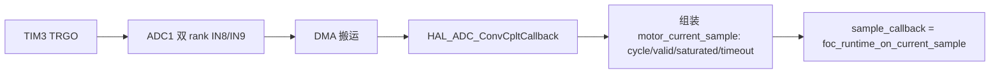

# 03 · 电流采样详细设计

> 状态：批次 A 对齐（INA240A2 标准增益已定档，零偏 OK 即置 scale_verified；闭环门禁 = scale && direction，sample_timing 不阻塞首个电流环；ADC 零偏采用原始保护 + 中位数/MAD 抗孤立尖峰）｜ 对应代码：`Core/Src/motor_adc.c/.h`、`Core/Src/motor_adc_zero_stats.c/.h`、`foc_current_model.c`，板级常量见 `board_config.h`
> 最后对齐：2026-09-09 S1 两段式重构 ｜ 上游规格：SPEC-CAL 第 6 章、HW-MCU 5.3/5.4

## 1. 职责与边界

- 一句话职责：提供失能态静态零偏采样与质量判定、PWM 关联的同步两相电流采样帧，并向上层注册采样回调。
- 负责：ADC1 双 rank DMA 扫描、零偏统计与五分类质量门、同步触发切换、饱和/超时/有效位标注。
- **明确不做**：不做 FOC 计算（DD-02）；不做运行时增益辨识（INA240A2 固定增益 + 已知 shunt 直接定档，外部电流表仅可选复核，见 §11）；不读 VBUS（硬件未接）。
- 上游：TIM3 TRGO 触发、DMA；下游：经 callback 喂 `foc_runtime_on_current_sample`。

## 2. 架构位置

## 3. 文件清单

| 文件 | 角色 |
| --- | --- |
| `motor_adc.c/.h` | 静态/同步采样、零偏质量门、diagnostic 门禁标志、latest sample |
| `foc_current_model.c` | raw 码→安培（zero/reference/shunt/gain/sign），Ic=-Ia-Ib |
| `board_config.h` | shunt=0.01Ω、INA240 gain=50、3.3V/4095、触发是否配置等常量 |

## 4. 关键数据结构

| 结构/字段 | 单位 | 范围 | 写入者 | 读取者 | 说明 |
| --- | --- | --- | --- | --- | --- |
| `motor_current_sample_t` | raw/cycle/ms | 0..4095 | DMA 回调 | runtime | valid/saturated/timeout 三标志 |
| `motor_adc_zero_calibration_t` | raw | — | 零偏标定 | diagnostic/控制环 | 原始均值/中位数/MAD/离群点、过滤后零偏/min/max/峰峰/质量 |
| `motor_adc_zero_stats_t` | raw | 0..4095 | `motor_adc_zero_stats` | `motor_adc` | 64 点窗口的稳健统计；仅在启动慢路径串行调用 |
| `motor_adc_current_diagnostic_t` | — | — | motor_adc | 上层门禁 | scale/direction/sample_timing/closed_loop 四 verified |

## 5. 关键流程与状态机

- 静态零偏：驱动失能+PWM 停前提下采 64 点；先保留原始均值/min/max/p2p，再以中位数和 MAD 识别孤立尖峰，剔除后用有效样本均值作为本次零偏，并以过滤后 p2p 进入质量门；
- 同步采样：`start_synchronized` 切 TIM3 触发、循环 DMA、启动 TIM3；每完成一帧 cycle++、打饱和/有效标志并回调；
- 最新帧超过 2ms 未更新判 timeout。

## 6. 关键机制与取舍

- **五分类质量门**：NEAR_RAIL（原始窗口近上下轨，留 16 code 边距）/ FLATLINE（原始窗口无变化）/ NOISY（过滤后有效样本峰峰>32 code、异常点过多或有效点不足）/ ADC_ERROR / OK；近轨或噪声直接置电流态 FAULT，原始量程异常不能被过滤掩盖。
- **饱和判定**：任一相 raw ≤16 或 ≥4095-16 即 saturated，该帧 valid=0。
- **门禁四标志**：scale/direction/sample_timing/closed_loop 当前恒 0，标定 S1/S4 后经新增 setter 逐项置位（规划补 setter 接口）。
- **两相重构第三相**：Ic=-Ia-Ib，其和恒零是定义，不能当独立校验证据。

## 7. 对外接口契约

| 函数 | 前置 | 后置 | 上下文 |
| --- | --- | --- | --- |
| `motor_adc_init_static()` | 安全态 | ADC 硬件校准 | 主循环初始化 |
| `motor_adc_calibrate_zero_current()` | 驱动失能、PWM 停 | 64 点零偏+质量 | 主循环，**内部阻塞读** |
| `motor_adc_start_synchronized()/stop_()` | 硬件已校准 | 循环 DMA+TIM3 | 主循环 |
| `motor_adc_set_sample_callback(cb)` | — | 注册快路径回调 | 初始化一次 |
| 【规划】`motor_adc_set_verified(flags)` | 对应标定步通过 | 置门禁位 | 主循环 |

## 8. 配置与阈值

| 宏 | 值 | 说明 |
| --- | --- | --- |
| 零偏样本数 | 64 | 失能态 |
| 轨边距 / 最大零偏噪声 | 16 / 32 raw | 近轨使用原始 min/max；噪声使用过滤后有效样本 p2p；32 数值保持不变 |
| MAD 离群下限 | 12 raw | `limit=max(12, ceil(4.5*MAD))`，严格 `abs(x-median)>limit` 才剔除 |
| 最大离群点数 / 最少有效点数 | 8 / 56 | 超过任一路离群点数或有效点不足即 NOISY |
| 样本最大年龄 | 2ms | 超时 |
| 标准传递系数 | 0.01Ω × INA240A2 50V/V = 0.5V/A | **板级设计常量，已对原理图/datasheet 确认，直接定档** |
| 1 code 电流 | 3.3/4095/0.5 ≈ 1.612mA | 0.04A≈24.8code、0.09V/2.3Ω≈24.3code |

## 9. 资源预算

- DMA 双 rank 缓冲极小；静态零偏阻塞采样只在非功率态执行；同步路径零阻塞。
- 64 点排序、MAD 和剔除只在启动校准慢路径执行；`motor_adc_zero_stats` 使用静态工作数组，不可从中断或并发上下文调用。
- 【待填写】同步采样窗口相对 PWM 计数的相位与时序余量（需示波器，见 §11）。

## 10. 验证与追溯

| 手段 | 覆盖 | 对应规格 |
| --- | --- | --- |
| BL2 静态采样 | 原始样本、尖峰剔除、零偏/质量门 | HW-MCU BL2、SPEC-CAL 6.1 |
| PC 统计单测 | 正常窗口、低/高孤立尖峰、多尖峰、宽分布和非法输入 | `tests/pc/test_motor_adc_zero_stats.c` |
| 示波器窗口确认 | 低边采样有效窗口 | SPEC-CAL 6.3 |
| 标定 S1a/S1b | 开环双极性定符号/通道 + 闭环自证 | SPEC-CAL 6.4 |

## 11. 非目标、已知限制、TODO

- 已知限制：无 VBUS ADC；TIM3 与 TIM2 未锁相；当前只做单窗口抗尖峰，不做跨窗口 EMA 漂移跟踪。
- 增益策略（2026-09-09 改定）：INA240A2 为固定 50V/V 增益器件（误差 ≤0.2%），配合 0.01Ω shunt，增益按**板级设计常量直接定档**，零偏质量 OK 即置 `scale_verified=1`；S1a 用标准增益把 raw 换算成电流做 R 量级 sanity（0.5~2 倍标称）。原 D2"FROZEN 前必须外部电流表绝对校准"**降级为可选复核**，代码仍可预留校准入口，但不再是建立首个电流环的前置门禁。
- 闭环门禁四标志语义：`scale_verified`（标准增益 + 零偏 OK）、`direction_verified`（S1a 开环判定通过）、`sample_timing_verified`（S4 阶跃自检，**不参与** S1b 首个电流环门禁，避免循环依赖）、`closed_loop_allowed = scale && direction`，在零偏质量更新与 `set_direction_verified` 内联动重算。
- TODO：① setter——`motor_adc_set_direction_verified()`（S1a 通过置 1 并联动门禁）、`motor_adc_set_sample_timing_verified()`（S4 通过置 1）；② **低边采样最小有效窗口 Tmin/扇区有效占空比确认**（占空比过短时某相下管导通不足，采到假值，需示波器）；③ INA240 REF1/REF2 图中接地与实测零偏非中点的完整偏置网络核对（open，不影响增益）；④ 可选的外部电流表增益复核流程与证据记录。
