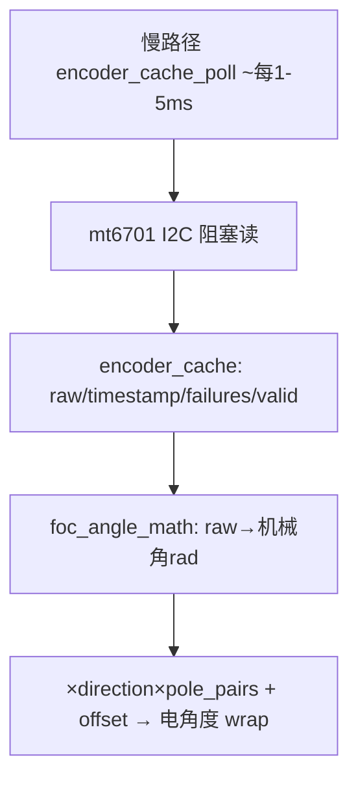

# 04 · 位置反馈详细设计

> 状态：骨架待填 ｜ 对应代码：`Core/Src/mt6701.c/.h`、`encoder_cache.c/.h`、`foc_angle_math.c/.h`
> 最后对齐：【待填写】 ｜ 上游规格：SPEC-CAL 第 10 章、HW-MCU 5.5

## 1. 职责与边界

- 一句话职责：读取 MT6701 绝对机械角、在慢路径缓存最新有效样本，并完成机械角→电角度换算（方向/极对数/零位）。
- 负责：I2C 读取与在线/磁场状态、样本缓存与时效判断、wrap/电角度换算。
- **明确不做**：不在 20kHz 快路径读编码器（I2C 阻塞）；不自动判定方向/极对数（归标定 DD-01 的 S6）。
- 上游：I2C2；下游：控制环（DD-02）提供电角度、标定（DD-01）S5/S6/S7。

## 2. 架构位置

## 3. 文件清单

| 文件 | 角色 |
| --- | --- |
| `mt6701.c/.h` | I2C2 阻塞读写、is_connected、read_snapshot（raw/角度/磁场状态） |
| `encoder_cache.c/.h` | 主循环轮询、保存最新样本、consecutive_failures、is_valid(max_age) |
| `foc_angle_math.c/.h` | wrap / wrap_signed / raw→rad / mech→electrical，纯函数 |

## 4. 关键数据结构

| 结构/字段 | 单位 | 范围 | 写入者 | 读取者 | 说明 |
| --- | --- | --- | --- | --- | --- |
| `encoder_cache_sample_t.raw_angle` | raw | 0..16383 | cache_poll | 控制/标定 | 14bit 机械角 |
| `.timestamp_ms / .valid / .consecutive_failures` | ms/bool | — | cache_poll | is_valid | 超 max_age 判无效 |
| `foc_rotor_config_t` | — | pp=7,dir=±1 | 参数集 | angle_math | offset 单位 rad |

## 5. 关键流程与状态机

- 机械角：`raw * 2π / 16384`；电角度：`wrap((dir<0 ? -θm : θm)*pp + offset)`；
- 慢路径每次 poll 读一次；消费方用 `encoder_cache_is_valid(max_age_ms)` 确认新鲜度。

## 6. 关键机制与取舍

- **阻塞 I2C 只在慢路径**：MT6701 读取是阻塞事务，严禁放进 20kHz 中断；故控制环用电角度来自最近一次缓存。
- **三速率对齐**：电流环 20kHz / 主循环 1ms / 编码器约 1–5ms，标定 S6/S7 必须以 `(tick, unwrapθm, unwrapθe)` 成对采样，不能每拍直接拿 latest 配对。
- **角度 wrap 与 unwrap**：闭环用 wrap 到 [0,2π)；标定拟合方向/pp 需要连续角，用 `foc_angle_wrap_signed` 与标定库 unwrap 跨绕处理。

## 7. 对外接口契约

| 函数 | 前置 | 后置 | 上下文 |
| --- | --- | --- | --- |
| `mt6701_is_connected()/read_snapshot()` | I2C 就绪 | 在线状态/快照 | 慢路径，阻塞 |
| `encoder_cache_poll()` | — | 更新最新样本 | 主循环 |
| `encoder_cache_get_latest()/is_valid(age)` | — | 样本指针/是否新鲜 | 主循环 |
| `foc_mechanical_to_electrical_rad(θm,pp,dir,offset)` | 参数合法 | 电角度 rad | 任意（纯函数） |

## 8. 配置与阈值

| 参数 | 值 | 说明 |
| --- | --- | --- |
| 分辨率 | 14bit / 16384 | 单机械周 |
| 极对数 / 默认方向 | 7 / +1 | 方向待标定 S6 校验 |
| **轮询周期** | **1ms（2026-09-13 Phase A，原 5ms）** | L4 根因=5ms 角度台阶（@ωe=130rad/s 平均滞后 ~17°，EMF 经 sinδ 泄漏污染 d 轴判据）；I2C 保持 100kHz、单次阻塞读 ≈0.45ms，实际更新率 ~600Hz、滞后降至 ~6°。回退判据=consecutive_failures 上升 |
| I2C 速率上限 | 400kHz（F103 外设上限，F1 无 Fast+） | Phase B 候选：改 main.c ClockSpeed 即可，需板载上拉复核（≥10kΩ 时 400k 上升沿缓、可能丢 ACK） |
| 样本有效最大年龄 | 现用 20ms | 1ms 轮询下可收紧至 10ms（待核） |

## 9. 资源预算

- I2C 阻塞耗时【待填写：实测单次读取毫秒数，确认不拖垮 1ms 主循环】；无大缓冲。

## 10. 验证与追溯

| 手段 | 覆盖 | 对应规格 |
| --- | --- | --- |
| BL2 静态读取 | 在线/角度可读/磁场状态 | HW-MCU BL2 |
| 标定 S5/S6/S7 | offset 多点、方向/pp、低速跟随 | SPEC-CAL 第 10 章 |

## 11. 非目标、已知限制、TODO

- 非目标：不做编码器非线性/偏心误差查表、不做 index search（绝对编码器无需）。
- TODO：S6 自动方向/极对数校验、S5 offset 多点圆周统计、读取耗时实测、轮询周期与有效年龄匹配。
