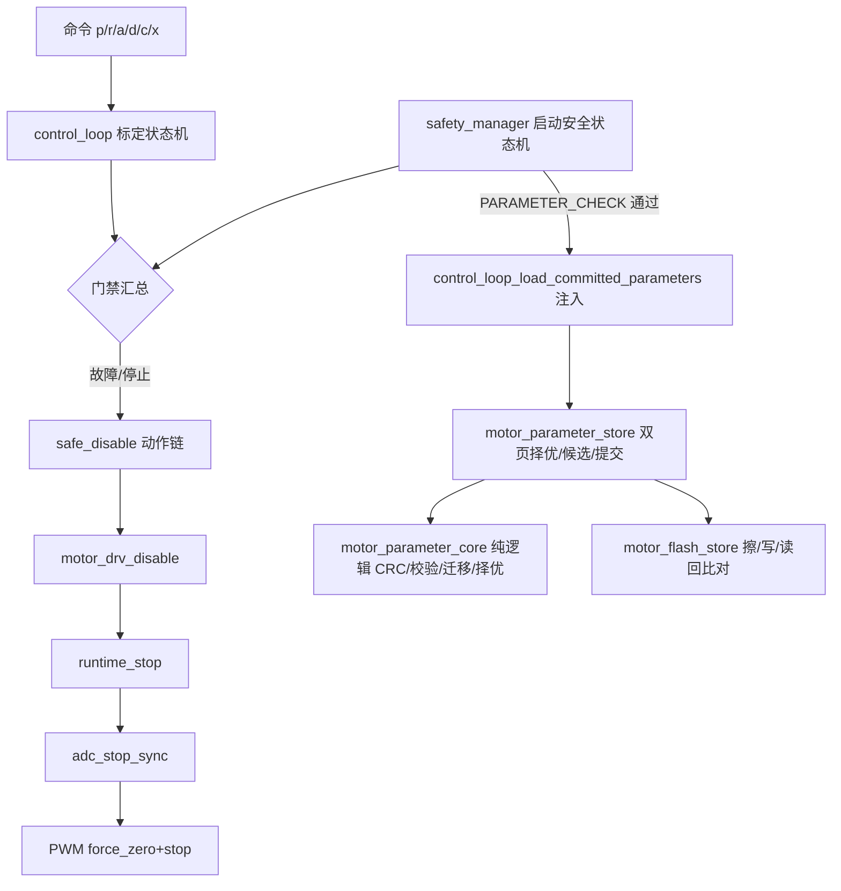

# 05 · 安全与状态机详细设计

> 状态：部分对齐（参数生命周期/Flash 双页/clear 语义已随 SPEC-RUN R2 落地，代码级待上板验收；运行态 R3 状态机未开始） ｜ 对应代码：`Core/Src/control_loop.c/.h`、`safety_manager.c/.h`、`motor_parameter_store.c/.h`、`motor_parameter_core.c/.h`、`motor_flash_store.c/.h`、`motor_drv.c`、`motor_pwm.c`
> 最后对齐：2026-09-11 SPEC-RUN R2 代码级实施（双页固化/上电注入/clear 双语义）｜ 上游规格：SPEC-CAL 第 2/11/12 章、SPEC-FOC 第 8 章、SPEC-RUN R2（FR-2.1~2.6）、附录 A/B

## 1. 职责与边界

- 一句话职责：保证"上电默认无功率、每步人工门、故障可锁存失能、参数按生命周期与硬件绑定流转、Flash 写入绝不动功率"。
- 负责：标定编排状态机、启动安全状态机、统一安全失能动作链、故障分类与锁存、参数包校验/候选/提交/固化/清除与硬件绑定。
- **明确不做**：不实现具体控制算法（DD-02）与采样（DD-03）；不绕过门禁；不假设拆机片 128KB Flash（一律按 64KB 保守设计，FR-2.1）。
- 上游：全部子系统的故障信号；下游：驱动使能/PWM 输出、参数存储（Flash 双页）。

## 2. 架构位置



## 3. 文件清单

| 文件 | 角色 |
| --- | --- |
| `control_loop.c/.h` | 标定序列状态机、功率步进确认、候选组装（v2）、apply/clear 语义、上电注入接收端、故障枚举 |
| `safety_manager.c/.h` | 启动检查状态机（BOOT_SAFE→PARAMETER_CHECK→ADC→SENSOR→READY）、安全故障锁存与清除、加载成功后触发参数注入 |
| `motor_parameter_store.c/.h` | 参数包 RAM 管理：双页择优 init/load、stage→commit 两阶段、RAM 激活、clear 双页擦除、状态码/来源页文本（重导出 core 接口） |
| `motor_parameter_core.c/.h`【SPEC-RUN 新增，零 HAL】 | 纯逻辑核心：参数包 v2 结构、CRC32（0xEDB88320 反射）、五道校验、v1→v2 迁移、双页择优 `select_page`；PC gcc 可单测（D6） |
| `motor_flash_store.c/.h`【SPEC-RUN 新增】 | Flash 后端：页擦除、半字编程、读回逐字比对，状态码三分类（ERASE/PROGRAM/VERIFY） |
| `motor_drv.c / motor_pwm.c` | 使能与 PWM 安全电平/强制零/停止输出 |

## 4. 关键数据结构

| 结构/字段 | 取值 | 写入者 | 读取者 | 说明 |
| --- | --- | --- | --- | --- |
| `control_loop_state_t` | SAFE_IDLE/BOOT/READY/POWER_ARMED/各辨识态/CANDIDATE_REVIEW/FAULT | control_loop | app/遥测 | c=clear 白名单取其中 4 个静默态 |
| `control_loop_fault_t` | PWM/DRIVER/ADC/ENCODER/TIMEOUT/CURRENT_LOOP/STEP_VALIDATE | 各处 | 状态机 | FAULT 锁存至 c 清除 |
| `motor_parameter_package_t`（v2） | format_version=2 + `phase_map_a/b/c`、`phase_seq_verified`、`learned_r_valid/count/history[3]/learned_phase_resistance_ohm/learned_r_revision` + R4 占位 5 字段 | 打包（control_loop 候选组装） | validate/注入 | 编译期静态断言 ≤1KB（FR-2.1）；CRC 覆盖除 crc 字段外全部字节 |
| `.hardware_id/motor_id/wiring_revision` | board_config | 打包 | validate | 任一不符拒绝加载（ID_MISMATCH） |
| `motor_parameter_store_status_t` | OK/NO_PACKAGE/INVALID_ARG/FORMAT/CRC/ID/RANGE/STATE/NOT_SAFE_IDLE + **FLASH_ERASE/PROGRAM/VERIFY_ERROR** | store/flash | 日志/命令层 | Flash 三态码对应 FR-2.2 明确报错 |

## 5. 关键流程与状态机

- 标定主状态机：TEST_BOOT→READY→POWER_ARMED→（各有功率步 S1a..S7）→CANDIDATE_REVIEW；任意运行态→FAULT（c 清除回 BOOT）；任意态 x→SAFE_IDLE。
- **参数生命周期（SPEC-RUN 后完整闭环，代码级）**：

```text
上电 → safety_manager BOOT_SAFE → PARAMETER_CHECK
  ├─ motor_parameter_store_init/load：双页择优（CRC 均过取 revision 新者、一坏取好、皆坏→CALIBRATION_REQUIRED）
  ├─ 加载成功 → control_loop_load_committed_parameters：
  │    存 loaded 镜像 → resistance_learning_load 重建学习态 → 灌入控制参数集
  │    （转子/符号/换相/静态 R、L）→ 生效 R 重算 id/iq ki → [LOAD] 打印页/rev/关键值
  └─ 标定产候选（DYNAMIC_CANDIDATE，judge_s7 四道门后 v2 组装）
       → a=apply：RAM 先激活 → phase_seq_verified？
            ├─ 是 → commit：擦非活跃页→写→读回校验→切活跃（COMMITTED，rev+1 链）
            └─ 否 → 仅 RAM 激活（本次启动生效，[APPLY] 明示 not persisted）
       → d=discard：只丢候选，不动 Flash
       → c=clear（非 FAULT 静默态）：擦双页 + 学习值回兜底 + loaded 失效 → 等同未标定
```

- **注入时序不变量**：`control_loop_init`（`app_baseline_init` 同步阶段）必先于 `safety_manager_poll` 的注入（主循环首次轮询）执行，`loaded_valid` 不会被初始化覆盖；注入时功率必为关闭（BOOT_SAFE 已 safe_disable）。

## 6. 关键机制与取舍

- **统一失能动作链顺序固定**：drv_disable → runtime_stop → adc_stop_synchronized → pwm_force_zero → pwm_stop_output，任何故障/停止都走同一条，确保栅极驱动电源与 PWM 同时撤掉。
- **人工功率门**：有功率步结束必回 POWER_ARMED，必须收到 `p` 才进下一步；run-all 也需低压限流+半自动已跑通的前置 gate。
- **硬件绑定防错用**：CRC 覆盖除自身外字段；hardware/motor/wiring 三 ID 任一不匹配即 ID_MISMATCH；改线必须 `wiring_revision++` 使旧包失效。
- **故障锁存**：FAULT 保持到 `c` 显式清除，不自动恢复功率。
- **双页 A/B 与掉电安全（FR-2.3）**：页 A `0x0800F800`、页 B `0x0800FC00`（代码区收缩 0xF800，机制见 §8）；写入时序"擦非活跃页→写→读回通过→切活跃"，旧页保留为回滚副本，**任意时刻掉电至少一页完整**；择优取 revision 新者、相等取 A（确定性回退，避免随机）。择优逻辑零 HAL 纯函数 `motor_parameter_core_select_page`，PC 四用例覆盖。
- **写 Flash 绝不动功率（FR-2.2）**：commit/clear 仅在 SAFE_IDLE（`safe_idle=1` 实参）放行，且调用链上层已要求静默态白名单；F1 擦写 stalls 内核，禁止运行态擦写。
- **c=clear 双语义（方案 A，2026-09-11 拍板）**：FAULT 态 c= 清故障（原行为）；非 FAULT 态 c= 清参数存储。分流在 app_baseline 命令层判 `control_loop_get_state()`，`control_loop_request_clear_storage` 内再验静默态白名单（SAFE_IDLE/TEST_BOOT/TEST_READY/CANDIDATE_REVIEW）双保险；失败返回 `CONTROL_LOOP_COMMAND_REJECTED_STORAGE` 并打状态码。
- **相序门禁贯穿固化（FR-1.3）**：`phase_seq_verified` 由 PSEQ_COMMIT 四出口维护（verify ok/镜像纠正→1；无样本/inconclusive→0）；未验证候选只允许 RAM 激活、不得进 Flash——apply 分流硬编码此规则，不依赖调用方自觉。
- **RAM 与 Flash 措辞可区分（FR-2.5）**：`[APPLY] committed to flash (source page X); rev=N` / `[APPLY] flash commit failed (<码>); RAM-only for this boot` / `[APPLY] phase-seq unverified; RAM-only for this boot (not persisted)`。

## 7. 对外接口契约

| 函数 | 前置 | 后置 | 上下文 |
| --- | --- | --- | --- |
| `control_loop_request_power_confirm()` | 态=POWER_ARMED | 进入对应有功率态 | 主循环（命令） |
| `control_loop_request_stop()` / `fault_clear()` | 任意 / FAULT | SAFE_IDLE / 回 BOOT | 主循环 |
| `control_loop_request_candidate_apply()` | CANDIDATE_REVIEW 且候选 ready | RAM 激活 +（verified 则）Flash commit；回 TEST_READY | 主循环 |
| `control_loop_request_clear_storage()`【新增】 | 静默态白名单内 | 双页擦除 + 学习值回兜底 + 回 TEST_BOOT；失败 REJECTED_STORAGE | 主循环（命令 c 非 FAULT 分支） |
| `control_loop_load_committed_parameters(pkg)`【新增】 | PARAMETER_CHECK load 成功 | loaded 镜像 + 学习态重建 + 控制参数集注入 + [LOAD] 日志 | safety_manager_poll |
| `motor_parameter_store_stage/commit_candidate(safe_idle=1)` | 候选态 / SAFE_IDLE | stage / 擦→写→读回→切活跃 | 主循环 |
| `motor_parameter_store_activate_ram_candidate()` | 候选 staged | RAM active=COMMITTED+CRC，不碰 Flash | 主循环（未验证/降级路径） |
| `motor_parameter_store_clear_storage(safe_idle=1)` | SAFE_IDLE | 双页擦除，RAM active 失效 | 主循环 |
| `motor_parameter_store_validate()` | — | OK 或具体错误码 | 加载/提交 |

## 8. 配置与阈值

| 参数 | 值 | 说明 |
| --- | --- | --- |
| HARDWARE_ID / MOTOR_ID / WIRING_REVISION | board_config | 改硬件/电机/接线须改 |
| FORMAT_VERSION | 加载接受 1/2（v1 迁移补默认），提交一律写 2 | `motor_parameter_core_migrate_v1` |
| FLASH 页地址 | A=0x0800F800、B=0x0800FC00（1KB/页） | 代码区收缩经 **uvprojx Target Dialog** 生效（IROM Start 0x08000000 / Size **0xF800**，`<Cpu>`/`<IROM>`/`<OCR_RVCT4>` 三处），`.sct` 为每次构建自动重生成件、手工改会被覆盖（2026-09-12 曾因此失效一晚）；验收证据=map 文件 `ER_IROM1 Max: 0x0000f800` |
| 参数包尺寸上限 | ≤1KB（编译期静态断言） | 超限直接编译失败 |
| clear 静默态白名单 | SAFE_IDLE/TEST_BOOT/TEST_READY/CANDIDATE_REVIEW | 运行中/POWER_ARMED/FAULT 一律拒绝 |

## 9. 资源预算

- 状态机/参数包均静态分配；`motor_parameter_package_t` v2 实测尺寸见 map（静态断言保证 ≤1KB，双页共占 Flash 2KB）。
- 代码区收缩后上限 62KB；**2026-09-13 实测 Total ROM 60.4KB（Code=55088 RO=5304 RW=316 ZI=9020），余量约 3KB**——已在风险预警区，新增功能（M-E/M-F）前先评估，必要时参数页改用 0x0800F000 起三页布局需同步升 wiring/文档。

## 10. 验证与追溯

| 手段 | 覆盖 | 对应规格 |
| --- | --- | --- |
| PC 单测（零 HAL，D6） | `test_motor_parameter_core.c`：CRC 敏感性、10 类校验拒绝、v1→v2 迁移、择优四用例+相等取 A+空 out | SPEC-RUN FR-2.3/2.6 |
| 故障注入 | 坏样本/超时/编码器丢失均可靠失能 | SPEC-FOC 第 8 章 |
| 参数包负向测试 | CRC/ID/范围/状态错均拒绝；人为坏页上电回退 | SPEC-CAL 第 11 章、SPEC-RUN FR-2.4 |
| 上板验收 V3–V6 | RAM-only/固化/重启注入/坏页回退/clear 双语义 | SPEC-RUN FR-1.3/2.4/2.5（脚本见 `20260911_SPEC-RUN代码补全状态核查与实施.md` §5.3） |

## 11. 非目标、已知限制、TODO

- 已知限制：本轮（2026-09-11）为**代码级交付**——rebuild 0E/0W、PC 单测运行、上板 V3–V6 验收均待执行；正常固件"读冻结参数→直接闭环"的运行态消费路径属 R3 未开始。
- TODO：R3 运行态状态机/准入门禁/故障链/遥测（SPEC-RUN §5）；故障枚举与文本补全；并入并重绘状态图（99_历史 滞后文档）；M-E/M-F 待本轮验收后另开。
- 决策 D4 解禁执行记录：SPEC-RUN 立项即申请解禁，本轮 R2 落地（64KB 保守 + 双页 + 掉电安全），风险项"代码逼近 62KB"持续观察。
