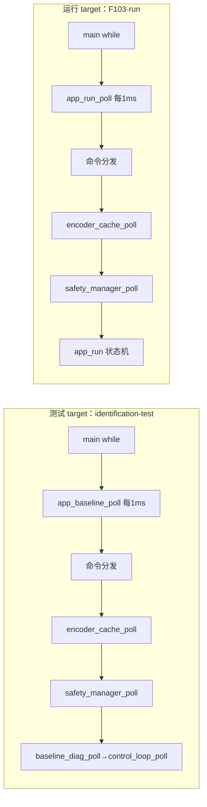

# 06 · 应用与遥测详细设计

> 状态：部分对齐（**app_run 骨架上板验证通过：FOC-4 四条 2026-09-13**，见 `../../06_验证与实验记录/标定报告/20260913_FOC-4_运行态骨架验收.md`；R3 功能——ISR 出角/I2C 400kHz/遥测定频/指令 hook/完整故障链迭代中）｜ 对应代码：`Core/Src/app_baseline.c`、`app_run.c`、`baseline_diag.c/.h`、`debug_log.c/.h`、`main.c`
> 最后对齐：2026-09-13 FOC-4 骨架验收（含两时序 bug 修复与三现象机理）｜ 2026-09-13 双 Target 基建（F103-run target + app_run 骨架，rebuild 0E/0W）｜ 上游规格：ARC-02、HW-MCU BL1/BL2、SPEC-RUN R3（FR-3.1~3.3 骨架级已验收）

## 1. 职责与边界

- 一句话职责：把各子系统在主循环里串起来，提供串口命令分发、启动静态诊断流水线与运行遥测日志。
- 负责：初始化顺序、主循环 poll 编排、命令解析、诊断检查与格式化日志。
- **明确不做**：不直接操作寄存器/引脚（归 board_config/驱动）；不做控制算法与标定判据（DD-01/02）。
- 上游：USART1 命令、各子系统状态；下游：调用 control_loop/safety/encoder 等接口。

## 2. 架构位置

两 target 由 `main.c` 的 `#if APP_MODE_RUN` 分流（工程预定义，非运行时切换）；20kHz FOC 不在此循环，由 ADC DMA 回调异步执行（见 DD-02）。

### 2.1 双 Target 构建策略（2026-09-13 拍板，SPEC-RUN R3 落地形态）

同一 `.uvprojx` 两个 target，共享源码树与 scatter（**参数页 0x0800F800/FC00 布局是两态合同，禁止单方改动**）：

| | 测试 target `STM32F103C8T6_BASE` | 运行 target `F103-run` |
| --- | --- | --- |
| 预定义 | `USE_HAL_DRIVER,STM32F103xB,CALIB_VJ_DIAG_ENABLE=1` | `USE_HAL_DRIVER,STM32F103xB,APP_MODE_RUN` |
| 排除文件 | —— | control_loop/calib_sequence/calib_step/calib_capture/calib_stats/resistance_learning/app_baseline |
| 新增文件 | —— | app_run.c/.h |
| 应用入口 | app_baseline_init/poll（标定全序列+固化） | app_run_init/poll（读固化包直入运行态） |
| VJ 判决工具 | **回归启用**（诊断工具住诊断固件） | 不编译 |
| ROM 占用 | 62352B（余量 1136B） | **32960B（余量 30.5KB）** |

**隔离机制（2026-09-13 固化）**：跨 target 文件用 Keil 原生 `FileOption/CommonProperty/IncludeInBuild=0` 标记——F103-run 排除 7 个测试源文件、测试 target 排除 app_run.c。背景：Keil 重开工程时会把文件树**回填**到两个 target（已知行为，并自加 ::CMSIS 空虚组），此前隔离靠 armlink `--remove` 对未引用段的 GC 兜底（产物正确但编译浪费且引用误加会无声链接）；显式标记后构建期即隔离，误引用直接报未定义符号。宏/输出名/内存布局 Keil 均保留不动。

**合同三铁律**：① 参数包格式/校验共享（`motor_parameter_core`），测试态标定的包运行态直接吃；② scatter/参数页一致；③ 每次交付两个 target 都 rebuild 0E/0W（NFR-4 扩展）。命令行构建入口 `MDK-ARM/_build_cli.cmd <target> <log>`（相对 ASCII 文件名即可；**uvprojx 手工编辑必须保 BOM 与原 XML 格式——Keil 拒收 DOM 重写文件，exit 15**）。**CubeMX 再生成实测（2026-09-13）**：双 target/宏/排除标记均幸存（工程文件增量更新）；被还原的是 USER CODE 区外历史手工补丁（TIM3 外设、TIM2 Period=7199、栈 0x800）——恢复走 git；根治需把 .ioc 与现实同步后再生成。

## 3. 文件清单

| 文件 | 角色 |
| --- | --- |
| `app_baseline.c/.h` | **测试 target 专属**：init 顺序、poll 编排、命令 switch、状态/电流日志 |
| `app_run.c/.h` | **运行 target 专属**：运行态骨架——boot→[LOAD] 读包（phase_map 按 DD-01 契约从包直取）→READY→使能（零流目标，FOC-4 第一步）→停机；编码器丢失→FAULT 不自动重启，c 重走准入 |
| `baseline_diag.c/.h` | 两 target 共享：启动静态流水线（quiet：PASS 一行汇总/WARN+FAIL 必打/`i` 全量）；`check_control` 按 APP_MODE_RUN 查不同状态源 |
| `debug_log.c/.h` | USART1 文本输出封装 |
| `main.c` | CubeMX 生成框架，`#if APP_MODE_RUN` 分流 app 入口 |

## 4. 关键数据结构

- 无复杂数据结构；主要为命令字符分发与诊断结果枚举（PASS/WARN/FAIL，worse 合并）。
- 【待填写】run-all 模式标志与命令字（规划 `g`）存放位置。

## 5. 关键流程与状态机

- 初始化：apply_safe_outputs → drv/pwm init safe → debug_log → safety_init → encoder_cache_init → foc_runtime_init → baseline_diag_init（内含 ADC init/零偏/control_loop_init/静态流水线）。
- 主循环：取命令 → encoder → safety → baseline_diag(内含 control_loop_poll) → `HAL_Delay(1)`。
- **运行态链（F103-run）**：init（banner/safe/safety_init）→ safety_manager PARAMETER_CHECK 异步载包并回调 `app_run_load_package`（load_default + 包标量/PI/map 灌入 + precompute；`motor_adc_set_direction_verified(1)`——包在=该板 S1a 已绑定符号）→ BOOT 准入评估（包+零偏 OK+编码器在线）→ READY；`p`=使能（同 start_power 时序：cfg→adc sync→forced_angle=当前电角→目标(0,0)→pwm→drv→runtime start）；`x`=safe_disable→READY；使能中每 1ms 喂编码器电角度（骨架限界：同 S7 口径，R3 正式改 ISR 出角）+500ms 遥测行；编码器丢失→先拉 MOTOR_EN 再 PWM 归零→FAULT，c→重走 BOOT。无包→NEED_CAL（提示烧测试固件）。

## 6. 关键机制与取舍

- **慢路径统一 1ms 节拍**：所有非实时编排、日志、I2C、统计都在此，保证快路径纯粹。
- **诊断与控制分离**：baseline_diag 只读状态做证据输出，不改变功率态；改变功率态只能经 control_loop 命令。
- **日志标签体系**：`[BOOT][DRV][PWM][ADC][CUR][ENC][CTRL][TEST][SAFE][LIMIT][ACTION][POWER][RESULT][CANDIDATE][FAULT][CMD][MON]`，NOGO 必须带处理提示。

## 7. 对外接口契约（命令表）

| 命令 | 作用 | 状态约束 |
| --- | --- | --- |
| `r` | 启动/重启标定序列 | 非 FAULT |
| `p` | 确认当前 POWER_ARMED 有功率步 | 仅 POWER_ARMED 接受 |
| `a`/`d` | 应用/丢弃候选 | 仅 CANDIDATE_REVIEW |
| `x` | 立即停止失能→SAFE_IDLE | 任意 |
| `c` | 清除控制+安全故障 | 仅 FAULT |
| `i`/`?` | 电流诊断 / 控制状态 | 任意，只读 |
| `g`【规划】 | 切换半自动/run-all | 需满足 run-all gate |

运行 target（F103-run）命令表（骨架集，R3 迭代扩充）：

| 命令 | 作用 | 状态约束 |
| --- | --- | --- |
| `p` | 使能并保持零流目标（FOC-4 第一步） | 仅 READY，准入门全过 |
| `x` | 停机失能→READY | 主要响应 ENABLED |
| `c` | 清故障→重走 BOOT 准入 | 仅 FAULT |
| `i`/`?` | 全量静态诊断明细（verbose pipeline） | 任意，只读 |

## 8. 配置与阈值

| 参数 | 值 | 说明 |
| --- | --- | --- |
| 主循环周期 | 1ms（HAL_Delay） | 慢路径节拍 |
| 诊断监视周期 | 500ms（现关闭周期日志） | 避免阻塞串口 |
| 单行日志缓冲 | 144~224B | 覆盖最长诊断行 |

## 9. 资源预算

- 日志为阻塞串口输出，仅慢路径；禁止在 20kHz 回调打印。栈上 line 缓冲见上。

## 10. 验证与追溯

| 手段 | 覆盖 | 对应规格 |
| --- | --- | --- |
| BL1 安全启动 | drv 失能/PWM compare=0/控制 safe | HW-MCU BL1 |
| BL2 静态诊断 | ADC/编码器可读并输出证据 | HW-MCU BL2 |
| 命令状态约束 | 非合法状态命令被拒 | SPEC-CAL 第 5 章 |

## 11. 非目标、已知限制、TODO

- 非目标：不做上位机波形绘图（现阶段仅文本遥测）。
- 已知限界（骨架级，R3 正式实现解决）：运行态角度为 1ms poll 喂 forced angle（同 S7 口径，~6°@130rad/s 滞后）；故障链仅覆盖编码器丢失（ADC 饱和/控制超时待 FR-3.4 补全）；遥测 500ms 一行未做带宽预算。
- TODO：R3 逐 FR 迭代（FR-3.3 ISR 出角与目标斜率、FR-3.4 完整故障链、FR-3.5 遥测定频、FR-3.6 指令 hook 抽象）；`g` run-all 命令与帮助文本；标定报告/窗口波形可导出格式（配合 `06_验证与实验记录/`）；关键结果一行质量摘要。
