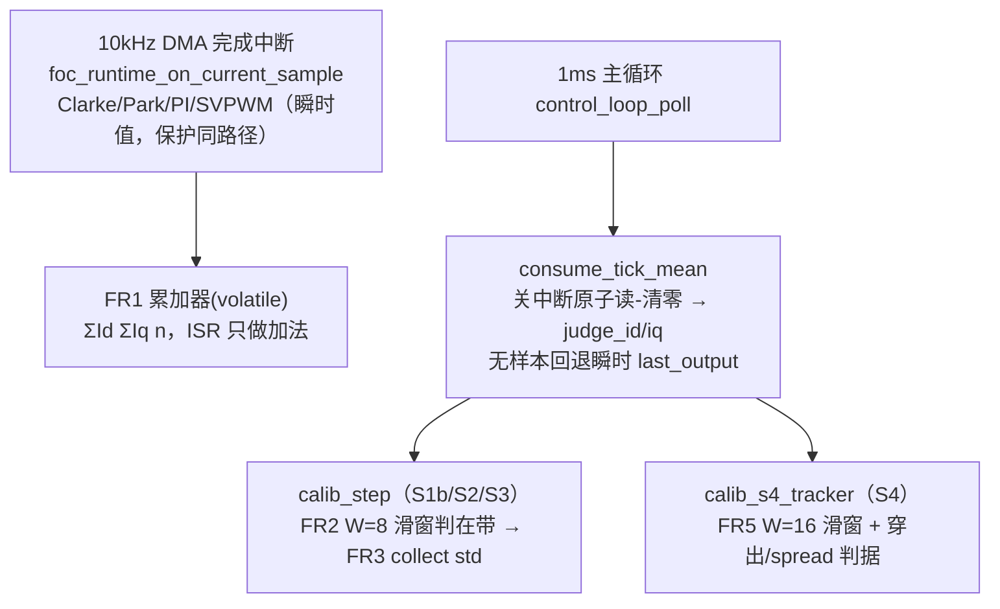

# 07 收敛判定抗单拍噪声需求与详细设计（情况 A）

> 状态：已实现（F103-identification-test-0.4 增量，待上板整定） ｜ 对应代码：`Core/Src/control_loop.c`、`Core/Src/foc_runtime.c`、`Core/Src/calib_step.c`、`Core/Src/calib_sequence.c` 及对应头
> 最后对齐：2026-09-10 ｜ 上游问题：S0 质量门在 32 code 两侧翻转、S1b/S4 逐拍判定被单拍噪声支配

---

## 1. 问题背景与实测证据

### 1.1 现象

5 次上电串口记录（F103-identification-test-0.4）：

| 上电 | zero(U,V) | p2p(U,V) | 质量门 | S0 |
| --- | --- | --- | --- | --- |
| 1 | 982,1701 | 40,39 | NOISY | FAIL |
| 2 | 950,1662 | 28,35 | NOISY | FAIL |
| 3 | 874,1565 | 24,29 | OK | PASS（S1a BINDABLE） |
| 4 | 863,1559 | 35,40 | NOISY | FAIL |
| 5 | 866,1564 | 30,31 | OK | PASS（S1a 一次 NOT-BOUND，重试后 BINDABLE） |

零偏均值本身在缓慢漂移（982→950→874→863→866 code），同时 p2p 在 32 code 质量门两侧翻转，造成"时过时不过"。

### 1.2 根因：判定器吃"最后一个瞬时样本"

- 完整 FOC 控制步（Clarke/Park/PI/SVPWM/PWM）跑在 **10kHz DMA 完成中断**（`BOARD_CONFIG_PWM_FREQUENCY_HZ=10000`，TIM2 period=7199@72MHz；`BOARD_CONFIG_CURRENT_LOOP_PERIOD_S=1/10000`）。
- 慢路径 1ms 主循环（main while → `app_baseline_poll` → `control_loop_poll`）原来只取 `foc_runtime_get_last_output()` 的**最后一个瞬时步**喂标定判定。
- 板级量纲：INA240A2 增益 50、shunt 10mΩ、500mV/A、12bit/3300mV → **1 code = 3.3/4095/0.5 = 1.612mA**。
- 实测单拍电流噪声 σ≈10~13mA（boot2 V 通道 64 点：sd=8.33 code=13.4mA）。
- 后果（白噪近似下的逐拍在带概率，z=带宽/σ）：
  - S1b ±10mA 收敛带：z≈0.75~1.0，逐拍在带率仅 55%~66%，连续 5 拍在带概率 ≈ 0.6⁵≈8%，"收敛"基本靠运气；
  - S4 2% 稳态带（目标 60mA 时 ±1.2mA）：z≈0.09，逐拍在带率约 9%，**现状理论上无法 settle**。

### 1.3 关键实测修正：噪声强相关，√N 收益打折

对 boot2 V 通道 64 点做自相关：**lag-1 ρ₁=0.723、lag-2 ρ₂=0.484**（非白噪）。因此"平均 N 个样本 σ/√N"的白噪公式显著高估平均收益，所有窗宽必须以实测相关噪声回放整定，不采信理论值：

| 平均层级 | 残余 σ（实测回放） | 白噪理论值 |
| --- | --- | --- |
| 单拍 | 13.4mA | 13.4mA |
| FR1：10 个 10kHz 样本拍均值 | 8.96mA | 3.17mA |
| FR1 + 慢路径 W=8 滑窗 | 1.49mA | 0.47mA |
| FR1 + 慢路径 W=16 滑窗 | **0.89mA** | 0.28mA |

## 2. 目标与非目标

### 2.1 目标（情况 A：只降低判定器对单拍噪声的敏感度，不降任何电气标准）

- FR1 快路径拍均值：慢路径每拍拿到"自上拍以来全部 10kHz 控制步"的 Id/Iq 均值用于判定。
- FR2 SETTLE 环形滑窗：在带判定吃最近 W 拍均值，窗未满不计在带。
- FR3 COLLECT 纹波门限：均值居中但窗内抖动过大（样本 std 超限）直接 NOGO，防止均值掩盖振荡。
- FR4 S1b Iq 均值判据：Iq≈0 改吃 COLLECT 段均值而非单拍。
- FR5 S4 tracker：稳态带判定吃 W=16 滑窗；建立后不再要求"零穿出"，改用"穿出占比 + 最长连续穿出 + 建立后窗内离散度"区分噪声孤立穿出与真实振荡。
- FR6 串口日志增强：打印窗均值 wm、纹波 sp、在带连数 run、穿出占比/最长连穿，供整定。

### 2.2 非目标（本次明确不做）

- **不降电气标准**：S1b ±10mA 收敛带、Iq≤20mA、S4 2% 稳态带、5Tc=50ms 建立上限、2000ms 单步超时一律不变。
- 不动 S0 的 32 code 质量门、不动 PI 参数、不做在线零矢量零偏自校准、不动 S1a PROBE3 基线/拟合、不改任何硬件。
- 保护/饱和/故障路径继续用瞬时值，**零额外延迟**。
- 已知既有缺陷"指数上升过程中窗均值穿过 2% 带时会提前判建立"（旧代码同样存在）仅记录，不在本次修。

## 3. 总体架构与数据流



- ISR 内只增加 2 次浮点加法 + 1 次自增，O(1)、无阻塞、无 I/O。
- 慢路径 consume 用 `__get_PRIMASK/__disable_irq/__set_PRIMASK` 原子读-清零（CMSIS 经 board_config.h→main.h→stm32f1xx_hal.h 可见，main.c 已用同款内联）。
- 判定延迟增加：S1b/S2 为 W+hold ≈ 13ms 级、S4 为 16+5=21ms 级，相对 2000ms/80ms 预算可忽略。

## 4. 需求条目详述

### FR1 快路径拍均值

- ISR 每个**成功**控制步（PWM 更新成功后）累加 `measured_current_a.d/q` 与计数；start/stop 清零。
- `uint8_t foc_runtime_consume_tick_mean(foc_dq_t *out, uint16_t *samples)`：原子取出均值并清零；返回 0（无样本）时调用方回退瞬时值，保证行为不劣于旧版。
- PI、SVPWM、硬件保护不经过本接口，仍用当拍瞬时值。

### FR2 SETTLE 滑窗在带判定（calib_step）

- 环形缓冲（物理上限 `CALIB_STEP_WINDOW_MAX=16`），每拍 O(1) 更新窗和与窗均值。
- `|window_mean - target| ≤ band` 且窗已填满才计一次在带；连续 hold=5 次进 COLLECT。
- `settle_window_cycles=0` 时逐拍退化（旧行为），供对照测试。
- 超时仍为硬 NOGO（`now - t0 > timeout`）。

### FR3 COLLECT 纹波门限（calib_step）

- COLLECT 用 Welford 在线算法累计均值与**样本标准差** spread；采满 collect_n 时，若 `spread_max>0 且 spread>spread_max` → NOGO，否则 EVALUATE。
- S3 阶跃前稳定档 collect_n=1、spread_max=0（关闭），行为与旧版一致。

### FR4 S1b Iq 均值判据（control_loop）

- COLLECT 段累加 judge_iq；EVALUATE 时用均值判 `|mean_iq| ≤ 20mA`，为 0 才回退当拍。
- Id 结果本就用 COLLECT 均值（step.mean），不变。

### FR5 S4 tracker 抗噪判据（calib_sequence）

1. **建立 settle**：W=16 窗均值进入 2% 带、连续 hold=5 窗、且建立时刻 ≤5Tc=50ms。
2. **静差 steady_err**：观测后半段窗均值误差均值 ≤2%（不变）。
3. **慢振荡 no_osc**：建立后允许噪声孤立穿出，要求
   - 最长连续穿出窗口数 ≤ `CALIB_S4_EXIT_RUN_MAX=2`；
   - 穿出窗口占建立后窗口比例 ≤ `CALIB_S4_EXIT_RATIO_MAX=0.35`。
   真实慢极限环（周期 ≥ 窗宽）表现为长连续穿出（实测 3%/T48 连穿 4、5%/T32 连穿 5~10、占比 0.45~0.65），必然失败。
4. **快速对称振荡 spread_ok**：窗均值会把逐拍交替振荡平均掉，故对**建立后**各窗内样本 std 的均值判 `spread/target ≤ 0.20`（上升瞬态不统计）。
5. **饱和 saturation**：逐拍统计 |Vd|≥95%Vlim 占比 ≤10%（命令量无噪声，不改）。
6. 五项与，evaluate 返回总判据，分项写入结果结构供打印。

### FR6 日志

- S1b 心跳：`[DBG] S1b ph id iq wm sp run n vd mode`；结果行加 `sp`；NOGO 打印 `wm/sp/band`。
- S4 100ms 心跳：`[DBG] S4 id wm sp run settled n`；结果行：`[RESULT] S4 settle steady_err% spread% exit%/runN osc sat`。

## 5. 配置参数与整定依据（全部集中 calib_config.h，标【待整定】）

| 宏 | 值 | 整定依据（实测相关噪声回放，64 个不同起点） |
| --- | --- | --- |
| `CALIB_SETTLE_WINDOW_CYCLES` | 8 | S1b/S2：FR1 后残余 1.49mA，对 10mA 带 z=6.7，余量充足；W=8 固定种子下 12 拍稳定，逐拍 W=0 需 165 拍 |
| `CALIB_S1B_SPREAD_MAX_A` | 0.015A | =1.5×收敛带；±16mA 对称振荡（std 17.1mA）被拒，FR1 残余噪声 std≈2.3mA 通过 |
| `CALIB_S2_SPREAD_MAX_A` | 0.015A | 同 S1b |
| `CALIB_S4_SETTLE_WINDOW_CYCLES` | **16** | **决定性证据：W=8 在实测噪声下 0/64 能建立；W=16 为 64/64，建立时刻中位 32ms、最大 47ms ≤50ms** |
| `CALIB_S4_SPREAD_RATIO_MAX` | 0.20 | 建立后噪声地板：spread 均值 0.152、最大 0.154；±15% 快速振荡 0.223 被抓；门限取两者之间 |
| `CALIB_S4_EXIT_RATIO_MAX` | 0.35 | 噪声孤立穿出占比实测最大 0.286；慢振荡 0.45~0.65 |
| `CALIB_S4_EXIT_RUN_MAX` | 2 | 噪声最长连续穿出 2（64 起点中仅 4 个达到 2）；慢振荡 ≥4 |
| 沿用不变 | hold=5、collect_n=8、timeout=2000ms、S4 band 2%、5Tc、observe 8Tc、饱和 0.95/0.10 | 电气标准不降 |

物理上限：`CALIB_STEP_WINDOW_MAX=16`、`CALIB_S4_WINDOW_MAX=16`（超宽截断）。

## 6. 文件清单

| 文件 | 改动 |
| --- | --- |
| `Core/Inc/foc_runtime.h` | 新增 `foc_runtime_consume_tick_mean` 声明 |
| `Core/Src/foc_runtime.c` | 3 个 volatile 累加器；start/stop 清零；ISR 成功步累加；原子 consume |
| `Core/Inc/calib_config.h` | 抗噪参数块（上表 7 个宏） |
| `Core/Inc/calib_step.h` | 窗上限、cfg 增 2 字段、struct 增环形窗字段 |
| `Core/Src/calib_step.c` | push_window；begin 清零；SETTLE 窗均值；COLLECT spread NOGO |
| `Core/Inc/calib_sequence.h` | S4 窗上限、tracker/result 字段、begin/evaluate 新签名 |
| `Core/Src/calib_sequence.c` | S4 滑窗、建立后穿出/spread 累计、五判据 evaluate |
| `Core/Src/control_loop.c` | begin_step 统一装窗；poll 顶部 consume；5 个 begin 调用点；S1b 均值判据与日志；S2/S3 喂 judge_id；S4 新参数/心跳/结果行 |
| `tests/pc/test_calib_sequence.c` | 适配新签名（begin 用配置窗宽、evaluate 补穿出参数） |
| `tests/pc/test_calib_settle_window.c` | **新增**：10 个主机回放用例（见第 7 节） |

## 7. 验证与验收口径

### 7.1 主机回放（纯算法层，不依赖 HAL）

在 `STM32F103C8T6_BASE` 目录下：

```
gcc -std=c99 -I Core/Inc Core/Src/calib_step.c Core/Src/calib_sequence.c ^
    Core/Src/calib_stats.c tests/pc/test_calib_settle_window.c -lm -o tests/pc/tw
tests\pc\tw.exe
```

既有 S1-S4 判据测试同理编译 `test_calib_sequence.c`。用例（期望值来自实测噪声回放，已用 Python 逐行镜像核对）：

1. 干净恒定输入第 20 拍 EVAL、均值精确；
2. FR1 残余 ±6mA 噪声 30 拍内 EVAL、均值偏差 <4mA；
3. 同一条 ±20mA 序列：W=8 第 40 拍已 EVAL，W=0 仍在 SETTLE；
4. 持续 +15mA 偏置 → 2000ms 超时 NOGO；
5. 均值居中 ±16mA 交替 → spread NOGO；
6. 干净 S4 指数曲线五判据全过、28ms 建立；
7. **boot2 实测相关噪声 64 起点 W=16 全部通过、最大建立 47ms**；
8. 同噪声 W=8 建立数 0/64（窗宽选择证据）；
9. ±15% 快速对称振荡被 spread 拒绝；
10. 5%/T32、3%/T48 慢振荡被穿出判据拒绝。

### 7.2 上板验收

- S0 通过后 S1b 一次进入即稳定收敛，`[DBG] wm` 平滑、`sp` <15mA；不再出现"逐拍进出带"抖动。
- S4 在真实电流环下 50ms 内 settled，结果行 spread/exit 数值与回放同量级（spread≈15%、exit<35%、run≤2）。
- 人为制造持续偏置/振荡必须 NOGO（保护能力不退化）。
- 编译零 warning（Keil AC5/AC6）。

## 8. 风险与已知限制

1. **相关噪声使 √N 打折**：ρ₁=0.72 下 FR1×10 只把 σ 从 13.4 压到 8.96mA；若后续硬件噪声进一步劣化（ρ 或 σ 变大），优先按第 5 节方法重放整定 W，其次才讨论窗宽上限（受 50ms 建立预算约束，S4 的 W 上限约 24）。
2. **spread 门限的物理下限是噪声地板**：建立后窗内 std 均值≈15% 目标，故比 15% 更小的快速对称振荡无法被软件区分（会被窗均值与 spread 同时淹没），只能靠硬件降噪或提高 FR1 过采样数。
3. **上升期穿带既有缺陷**：指数趋近过程中窗均值会"穿过"目标带，若上升极慢可能在尚未真正收敛时凑满 hold（DC+3% 也能 settle）。旧逐拍逻辑同样存在，本次未改；如需修复，应加"进入带前必须先从下方单调接近/进入带后斜率受限"约束，另立需求。
4. **零偏慢漂移不被本需求覆盖**：本方案只压"单拍离散噪声"。上电零偏均值随温度/时间的慢漂（982→866 code 那类）属于零偏校准问题，应走"上电/停机零点校准 + 限幅跟踪"的独立路线，不与窗平均混用。
5. **本机无 C 编译器**：开发机未安装 gcc/armcc，主机测试与算法逻辑已用 Python 3.14 逐行镜像完成数值验证（64 起点全场景），C 测试随源码交付，**需在 MinGW/w64devkit 或 Keil 环境由一条命令完成实际编译确认零 warning**；在该确认完成前，"编译通过"不作已验证项声明。

## 9. 决策记录（为什么是情况 A，而不是放宽电气门限）

- 被否决：放宽 S1b 带 / S4 2% 带。理由：这会直接降低识别出的 R/L 与电流环可信度，且 S4 的 2% 带在逐拍下 z=0.09，放宽到"能过"需要放到 15% 以上，等于取消电流环自证。
- 被否决：只加大 COLLECT_N。理由：COLLECT 发生在判定稳定之后，救不了"进不了稳定"的 SETTLE 阶段；且相关噪声下单纯加多点平均收益有限。
- 采纳：两级平均（FR1 拍内 + FR2/FR5 拍间窗）把"被测量"本身变稳，门限一律不动；再用 spread/穿出判据保证"均值掩盖异常"时仍然 NOGO——既压住误杀，又不放松抓真故障。
