# State Machine Flow

> ⚠️ **状态：滞后（历史文档）**。本图记录的是旧的"固定时间单点"流程（300/500/20ms 单点取值），
> 已不代表目标设计。标定序列将升级为 S0–S8 + 通用 step 引擎（收敛触发/统计/go-no-go）。
> 本文件待拆分并入《01_标定系统详细设计》与《05_安全与状态机详细设计》后废弃，当前仅留痕，勿作为实现依据。

This document describes the two application state machines implemented in the
F103 motor-identification firmware. It is intended to be read with a Markdown
viewer that supports Mermaid, but the transition labels also document the
source behavior in plain text.

## Control Loop

`control_loop` owns the manual, low-power motor identification sequence. It
starts with all motor outputs disabled. Every power-producing step requires an
explicit `p` command while the state is `POWER_ARMED`.

```mermaid
stateDiagram-v2
    [*] --> TEST_BOOT: control_loop_init / r / c

    TEST_BOOT --> TEST_READY: prepare test parameters
    TEST_READY --> POWER_ARMED: ADC zero precheck passes
    TEST_READY --> TEST_READY: ADC zero precheck fails; wait for r

    POWER_ARMED --> TEST_ALIGN: p; next step = ALIGN
    TEST_ALIGN --> POWER_ARMED: 300 ms; disable output

    POWER_ARMED --> R_IDENTIFICATION: p; next step = R
    R_IDENTIFICATION --> POWER_ARMED: 500 ms; estimate Rs; disable output

    POWER_ARMED --> L_IDENTIFICATION: p; next step = L
    L_IDENTIFICATION --> POWER_ARMED: 20 ms sample; estimate Ls; disable output

    POWER_ARMED --> TEST_CURRENT_VALIDATE: p; next step = CURRENT
    TEST_CURRENT_VALIDATE --> POWER_ARMED: 500 ms; disable output

    POWER_ARMED --> SENSOR_CALIBRATION: p; next step = SENSOR
    SENSOR_CALIBRATION --> POWER_ARMED: 400 ms; capture encoder offset; disable output

    POWER_ARMED --> LOW_SPEED_CAPTURE: p; next step = CAPTURE
    LOW_SPEED_CAPTURE --> CANDIDATE_REVIEW: 2500 ms; disable output

    CANDIDATE_REVIEW --> TEST_READY: a; apply candidate
    CANDIDATE_REVIEW --> TEST_READY: d; discard candidate

    POWER_ARMED --> FAULT: ADC / PWM / driver startup failure
    TEST_ALIGN --> FAULT: FOC runtime failure
    R_IDENTIFICATION --> FAULT: current-loop or estimate failure
    L_IDENTIFICATION --> FAULT: current-loop or estimate failure
    TEST_CURRENT_VALIDATE --> FAULT: FOC runtime failure
    SENSOR_CALIBRATION --> FAULT: FOC runtime or encoder failure
    LOW_SPEED_CAPTURE --> FAULT: FOC runtime or encoder failure

    FAULT --> TEST_BOOT: c; clear fault

    TEST_BOOT --> SAFE_IDLE: x
    TEST_READY --> SAFE_IDLE: x
    POWER_ARMED --> SAFE_IDLE: x
    TEST_ALIGN --> SAFE_IDLE: x
    R_IDENTIFICATION --> SAFE_IDLE: x
    L_IDENTIFICATION --> SAFE_IDLE: x
    TEST_CURRENT_VALIDATE --> SAFE_IDLE: x
    SENSOR_CALIBRATION --> SAFE_IDLE: x
    LOW_SPEED_CAPTURE --> SAFE_IDLE: x
    CANDIDATE_REVIEW --> SAFE_IDLE: x
    SAFE_IDLE --> TEST_BOOT: r; restart identification
```



### Control Commands

| Command | Meaning |
| --- | --- |
| `r` | Restart the identification sequence. |
| `p` | Confirm the currently armed power step. |
| `x` | Stop immediately, disable driver and PWM, then enter `SAFE_IDLE`. |
| `c` | Clear a latched control or safety fault. |
| `a` | Commit the reviewed candidate parameters. |
| `d` | Discard the reviewed candidate parameters. |
| `?` | Print control and safety state; does not change state. |
| `i` | Print current diagnostics; does not change state. |

## Safety Manager

`safety_manager` performs low-frequency startup checks. Its safe-disable action
drives `MOTOR_EN` inactive, clears PWM compare registers, and stops all PWM
channels. `FAULT` remains latched until command `c` requests a clear.

```mermaid
stateDiagram-v2
    [*] --> BOOT_SAFE: safety_manager_init
    BOOT_SAFE --> PARAMETER_CHECK: keep motor output disabled

    PARAMETER_CHECK --> ADC_ZERO_REFRESH: stored parameters load
    PARAMETER_CHECK --> CALIBRATION_REQUIRED: parameters unavailable

    ADC_ZERO_REFRESH --> SENSOR_CHECK: ADC init and zero calibration pass
    ADC_ZERO_REFRESH --> FAULT: ADC init or zero calibration fails

    SENSOR_CHECK --> READY: MT6701 responds
    SENSOR_CHECK --> FAULT: MT6701 connection fails

    FAULT --> BOOT_SAFE: c; clear fault
    READY --> SAFE_STOP: safe-stop request
    SAFE_STOP --> SAFE_STOP: output remains disabled
    CALIBRATION_REQUIRED --> CALIBRATION_REQUIRED: output remains disabled
```



## Runtime Relation

The main loop calls the state machines in this order:

```text
UART command -> encoder cache refresh -> safety_manager_poll
             -> baseline_diag_poll -> control_loop_poll
```

The 20 kHz FOC calculation is not run by this loop. After a power step starts,
ADC DMA completion calls `foc_runtime_on_current_sample`, which runs the FOC
controller and updates the three PWM compare values.

## Source References

- `Core/Src/app_baseline.c`: low-frequency application loop and UART commands.
- `Core/Src/baseline_diag.c`: invokes `control_loop_poll`.
- `Core/Src/control_loop.c`: identification state machine and power sequence.
- `Core/Src/safety_manager.c`: startup safety state machine.
- `Core/Src/foc_runtime.c`: current-sample callback and FOC execution.
